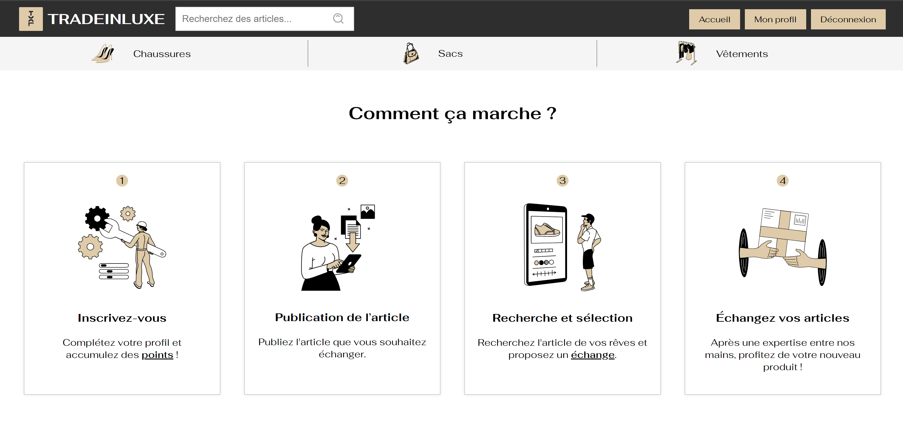
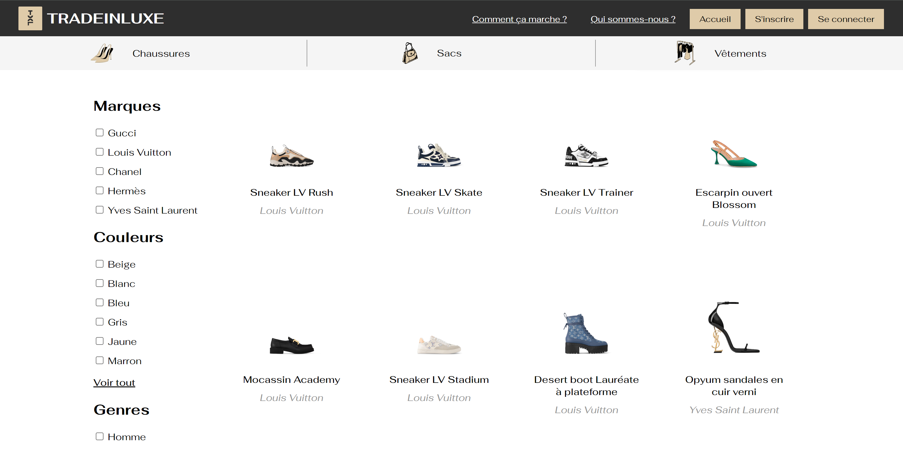
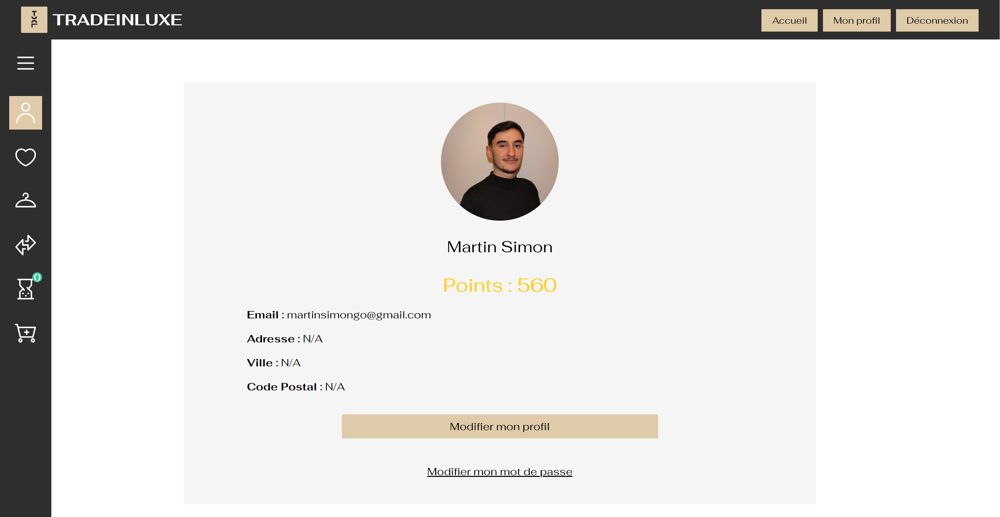

<h1 align="center" style="font-size: 36px;"> ESGI X EIML </h1>

# TradeInLuxe

TradeInLuxe est une plateforme d'échange en ligne pour les articles de luxe, développée en collaboration avec l'École Internationale de Marketing du Luxe (EIML). Le projet vise à permettre aux utilisateurs d'échanger des articles de luxe entre particuliers, avec une vérification effectuée par les experts de TradeInLuxe. Le système inclut également un système de points pour évaluer les articles et faciliter les échanges entre utilisateurs.

# Essayer 🧪

## 👉 [TradeInLuxe](https://tradeinluxe.martinsimon-dev.com/) 

## Fonctionnalités 💻

- **Échange d'articles de luxe :** Les utilisateurs peuvent proposer des articles de luxe à échanger avec d'autres utilisateurs de la plateforme. Les échanges sont vérifiés par les experts de TradeInLuxe pour garantir l'authenticité et la qualité des articles.

- **Système de points :** Chaque article se voit attribuer un certain nombre de points en fonction de sa valeur. Les utilisateurs peuvent accumuler des points en proposant des articles à échanger ou en effectuant des transactions sur la plateforme. Les points peuvent être utilisés pour échanger des articles ou pour valoriser des propositions d'échange.

- **Interface utilisateur intuitive :** La plateforme offre une interface conviviale pour parcourir les articles disponibles, proposer des échanges, gérer les comptes utilisateur et suivre le statut des transactions.

## Technologies Utilisées 🧙‍♂️

- **Symfony 7 :** Utilisé comme framework PHP pour le développement backend de l'application. Symfony fournit une structure robuste et des fonctionnalités avancées pour la gestion des routes, des contrôleurs, des formulaires et des entités.

- **Docker :** Utilisé pour la conteneurisation de l'application, facilitant le déploiement et la gestion de l'environnement de développement.

- **MySQL :** Utilisé comme base de données relationnelle pour stocker les données utilisateur, les données des articles, les échanges et les transactions etc...

- **Hotwire Stimulus.js :** Utilisé pour le développement frontend de l'application, fournissant des fonctionnalités dynamiques et interactives sans avoir besoin d'un framework JavaScript lourd.

## Installation et Utilisation ⚗️

Pour installer et exécuter TradeInLuxe sur votre machine locale, suivez ces étapes :

1. Clonez le dépôt GitHub sur votre machine locale.
2. Assurez-vous que Docker est installé sur votre machine.
3. Lancez Docker Desktop.
4. Se rendre dans le dossier `www` en faisant `cd .\TradeInLuxe\www\` et exécutez cette suite de commandes dans votre terminal :
   ```bash
   docker compose up -d
   composer install
   npm install
   symfony console d:m:m
   symfony console d:f:l
   symfony serve -d
   npm run watch  
   ```
### Puis se rendre sur : <a href="https://127.0.0.1:8000/">localhost</a>

## Petit aperçu 👀



</br>


